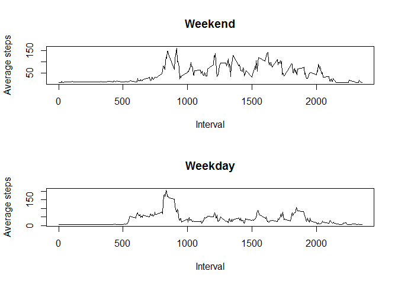

# Reproducible Research: Peer Assessment 1


## Loading and preprocessing the data

```r
if(!file.exists("activity.csv")) {
    unzip("activity.zip", c("activity.csv"))
}
data <- read.csv("activity.csv", header = T, sep = ",", na.strings = "NA")
data <- transform(data, date = as.Date(date, "%Y-%m-%d"))
str(data)
```

```
## 'data.frame':	17568 obs. of  3 variables:
##  $ steps   : int  NA NA NA NA NA NA NA NA NA NA ...
##  $ date    : Date, format: "2012-10-01" "2012-10-01" ...
##  $ interval: int  0 5 10 15 20 25 30 35 40 45 ...
```

## What is mean total number of steps taken per day?
1. Total number of steps taken per day

```r
stepsPerDay <- aggregate(steps ~ date, data, sum, na.rm = T)
stepsPerDay
```

```
##          date steps
## 1  2012-10-02   126
## 2  2012-10-03 11352
## 3  2012-10-04 12116
## 4  2012-10-05 13294
## 5  2012-10-06 15420
## 6  2012-10-07 11015
## 7  2012-10-09 12811
## 8  2012-10-10  9900
## 9  2012-10-11 10304
## 10 2012-10-12 17382
## 11 2012-10-13 12426
## 12 2012-10-14 15098
## 13 2012-10-15 10139
## 14 2012-10-16 15084
## 15 2012-10-17 13452
## 16 2012-10-18 10056
## 17 2012-10-19 11829
## 18 2012-10-20 10395
## 19 2012-10-21  8821
## 20 2012-10-22 13460
## 21 2012-10-23  8918
## 22 2012-10-24  8355
## 23 2012-10-25  2492
## 24 2012-10-26  6778
## 25 2012-10-27 10119
## 26 2012-10-28 11458
## 27 2012-10-29  5018
## 28 2012-10-30  9819
## 29 2012-10-31 15414
## 30 2012-11-02 10600
## 31 2012-11-03 10571
## 32 2012-11-05 10439
## 33 2012-11-06  8334
## 34 2012-11-07 12883
## 35 2012-11-08  3219
## 36 2012-11-11 12608
## 37 2012-11-12 10765
## 38 2012-11-13  7336
## 39 2012-11-15    41
## 40 2012-11-16  5441
## 41 2012-11-17 14339
## 42 2012-11-18 15110
## 43 2012-11-19  8841
## 44 2012-11-20  4472
## 45 2012-11-21 12787
## 46 2012-11-22 20427
## 47 2012-11-23 21194
## 48 2012-11-24 14478
## 49 2012-11-25 11834
## 50 2012-11-26 11162
## 51 2012-11-27 13646
## 52 2012-11-28 10183
## 53 2012-11-29  7047
```

2. Histogram of the total number of steps taken each day

```r
hist(stepsPerDay$steps, main = NULL, xlab = NULL, ylab = NULL)
```

 

3. Mean and median of the total number of steps taken per day

```r
summary(stepsPerDay$steps)
```

```
##    Min. 1st Qu.  Median    Mean 3rd Qu.    Max. 
##      41    8841   10760   10770   13290   21190
```

## What is the average daily activity pattern?
1. Time series plot of the 5-minute interval (x-axis) and the average number of steps taken, averaged across all days (y-axis)

```r
stepsPerInterval <- aggregate(steps ~ interval, data, mean, na.rm = T)
plot(stepsPerInterval$interval, stepsPerInterval$steps, type = "l", xlab = "Interval", ylab = "Average steps")
```

 

2. On average across all the days in the dataset, the 08:35 5-minute interval contains the maximum number of steps

```r
head(stepsPerInterval[order(stepsPerInterval$steps, decreasing = T), ], 5)
```

```
##     interval    steps
## 104      835 206.1698
## 105      840 195.9245
## 107      850 183.3962
## 106      845 179.5660
## 103      830 177.3019
```

## Imputing missing values
1. Analysis of total number of missing values in the dataset

```r
missingValues <- nrow(data) - sum(complete.cases(data))
missingValues
```

```
## [1] 2304
```

```r
missingValues / nrow(data)
```

```
## [1] 0.1311475
```

```r
sum(is.na(data$steps))
```

```
## [1] 2304
```

```r
sum(is.na(data$date))
```

```
## [1] 0
```

```r
sum(is.na(data$interval))
```

```
## [1] 0
```

2. I´m filling the missing values with the mean for that 5-minute interval and create a new dataset

```r
avgStepsPerInterval <- aggregate(steps ~ interval, data, mean, na.rm = T)
avgStepsPerInterval <- transform(avgStepsPerInterval, steps = round(steps, digits = 0))
r <- merge(data, avgStepsPerInterval, by="interval", suffixes=c(".data", ".avg"))
na.idx <- which(is.na(data$steps))
completeData <- data
completeData[na.idx,"steps"] <- r[na.idx,"steps.avg"]
nrow(completeData) - sum(complete.cases(completeData))
```

```
## [1] 0
```

3. The initial datased had 13.11% of missing values. After imputing missing values I observed increases in the mean and median. The mean changed from 10770 to 10890 (1.11% increase) and the median changed from 10760 to 11020 (2,41% increase).

```r
newStepsPerDay <- aggregate(steps ~ date, completeData, sum)
par(mfrow = c(1, 2))
hist(newStepsPerDay$steps, main = "With imputed missing values", xlab = NULL, ylab = NULL)
hist(stepsPerDay$steps, main = "With missing values", xlab = NULL, ylab = NULL)
```

 

```r
summary(newStepsPerDay$steps)
```

```
##    Min. 1st Qu.  Median    Mean 3rd Qu.    Max. 
##      41    8821   11020   10890   13460   24150
```

```r
summary(stepsPerDay$steps)
```

```
##    Min. 1st Qu.  Median    Mean 3rd Qu.    Max. 
##      41    8841   10760   10770   13290   21190
```

## Are there differences in activity patterns between weekdays and weekends?
1. Creating a new factor variable in the dataset with two levels - "weekday" and "weekend" indicating whether a given date is a weekday or weekend day.

```r
Sys.setlocale("LC_TIME", "C")
```

```
## [1] "C"
```

```r
completeData[, "type"] <- factor(ifelse(weekdays(data$date, abbreviate = T) %in% c("Sat", "Sun"), "weekend", "weekday"))
str(completeData)
```

```
## 'data.frame':	17568 obs. of  4 variables:
##  $ steps   : num  2 2 2 2 2 2 2 2 2 2 ...
##  $ date    : Date, format: "2012-10-01" "2012-10-01" ...
##  $ interval: int  0 5 10 15 20 25 30 35 40 45 ...
##  $ type    : Factor w/ 2 levels "weekday","weekend": 1 1 1 1 1 1 1 1 1 1 ...
```

2. Created a panel plot containing a time series plot of the 5-minute interval (x-axis) and the average number of steps taken, averaged across all weekday days or weekend days (y-axis).

```r
par(mfrow = c(2, 1))
sub <- subset(completeData, type == "weekend")
steps <- aggregate(steps ~ interval, sub, mean)
plot(steps$interval, steps$steps, type = "l", xlab = "Interval", ylab = "Average steps", main = "Weekend")
sub <- subset(completeData, type == "weekday")
steps <- aggregate(steps ~ interval, sub, mean)
plot(steps$interval, steps$steps, type = "l", xlab = "Interval", ylab = "Average steps", main = "Weekday")
```

 
